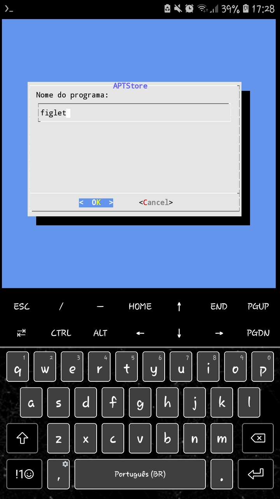

# APTStore

É um shell script para facilitar a instalação de programas em linux que não tenha loja, só via `apt install <nome_do_programa>`

# Modo de Uso
Para rodar basta digitar: `bash apt-store` ou `./apt-store`  
caso tenha dado permissão de execução.

# Screenshots / Exemplos

